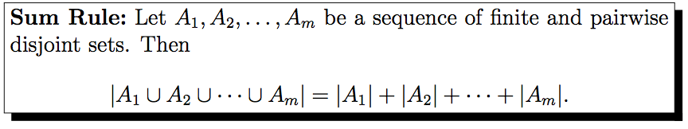
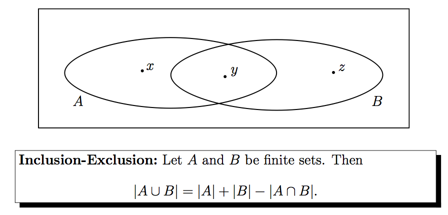

#3.5 - The Principle of Inclusion and Exclusion

##Sum Rule

If there are two finite sets that are disjointed, meaning that the cardinality __intersection__ of A with B is __zero__. In other words, we can apply the sum rule if our sets have __no overlap__.

##Inclusion and Exclusion

The problem with the __sum rule__ is it doesn't account for adjointments (overlap).

This formula essentially calculates the cardinallity of the union of both sets.

Since there is some overlap what we do is:

1. Calculate the summation of both sets
2. Since the overlap has been accounted for twice, we subtract the cardinallity of the intersection.

