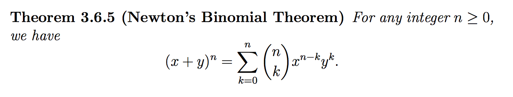

#3.6.2 Newton's Binomial Theorum

Allows us to solve for coefficients in any polynomial.

Say we are trying to identify the coefficient at a x13y12...

We know that our value for `n` will be `25`, because of the sum of our exponents, `(n-k)+k`.

So the coefficient will be nCk, which evaluates to <code>25C12 = 5200300 </code>

